# FracViewWpf

## FracViewWpf technical documentation

See the [doc/technical.md](doc/technical.md) technical documentation file.

## User Manual

### Intro

The first time you run the application you should see a window like the following

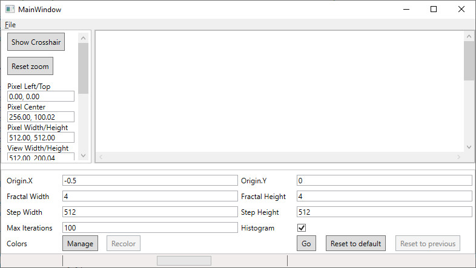

On the left side of the application is the "stats area". This will explain the coordinates of the area currently in view. On the bottom of the application is the "settings area". Here is where runtime settings can be changed.

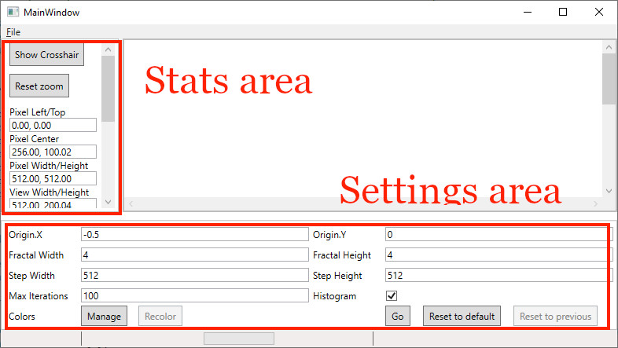

If you click "Go" in the settings area it will calculate the image according to the specified parameters.

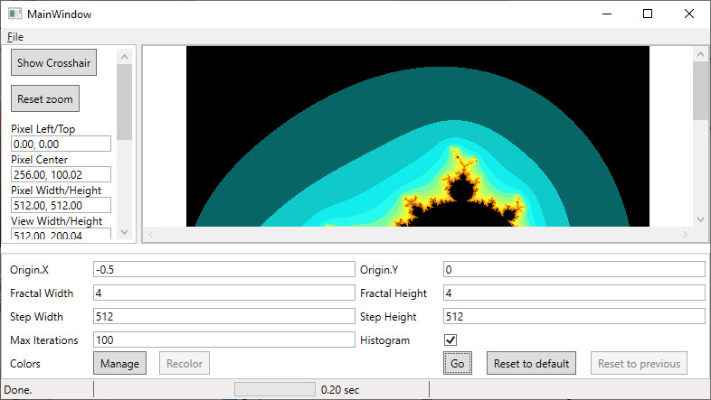

The window can be resized to reveal more "stats" on the left, and show the full image.

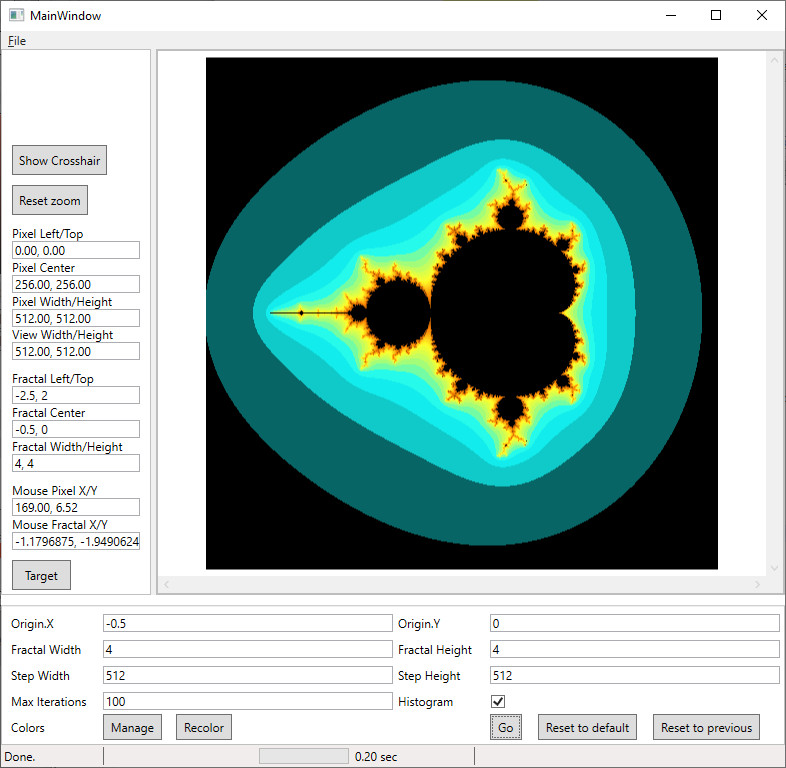

Use the mouse wheel to zoom out or zoom in. When zooming the application tries to keep the current center pixel in the same location and scale everything from this point. Note that the point data is not calculated automatically, only the user interface is scaled. Once zoomed in, click and drag with the left mouse button to pan the image. Alternatively, once zoomed in scrollbars will be available and can be used to pan the image.

Click the "Reset zoom" button in the "stats area" to return to the default zoom.

Click the "show crosshair" button to enable a crosshair on the image. This will allow more precise targetting. Once the crosshair is over a desired location, click the "Target" button in the "stats area" to set the runtime settings to the new location.

Example (with crosshair enabled) after zooming in with the mouse and clicking "Target":

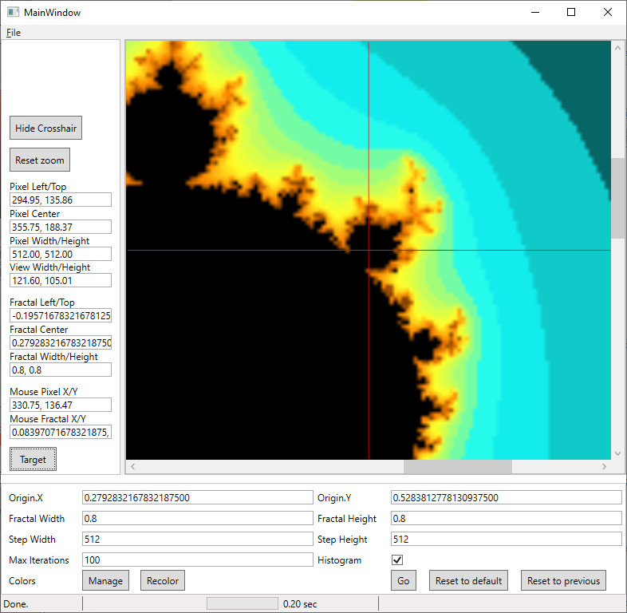

Clicking the "Target" button updates the origin location, as well as the width and height of the area.

The origin, fractal width, and fractal height can be restored to the last used values by clicking "Reset to previous" in the "settings area."

After "targetting" a new location, or otherwise adjusting the settings, clicking "Go" will compute the points in the selected area. The zoom (user interface scale) will be reset to the default at this point.

Note: when color information is "saved" or when point information is computed (clicking "Go"), the current settings are saved to disk. When the application starts it will attempt to reload the previous settings from "session.json" file (located in same directory as executable).

### Stats area

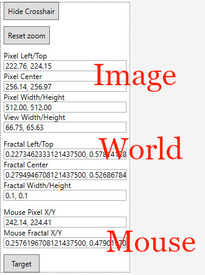

The stats area is a sliding panel on the left of the application. Click and drag the edge to make this area smaller or larger.

The crosshair button is used to show or hide a red crosshair. This will precisely show the center of the screen (the center point is used as the zoom origin).

The "reset zoom" button will adjust the zoom level back to 1.0.

Below the top buttons, "stats" are separated into three sections. The top section displays "image" information. This explains the view in terms of the generated image.

The section section explains the "world" or fractal information. This gives the left and top coordinate, the center (origin), and width and height.

The last section gives both "image" and "world" coordinates for the mouse.

The "Target" button takes the currently centered location and makes that the new runtime settings.

### Settings area

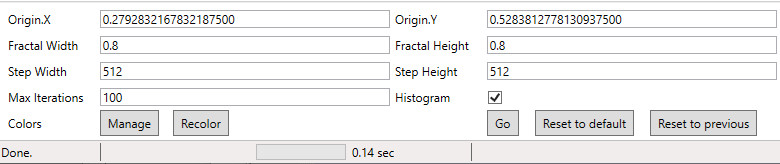

The settings area defines the runtime settings. This gives the fractal origin and width and height of area to calculate. The StepWidth and StepHeight are the size in pixels of the image to render.

Max iterations is the maximum number of steps to evaluate a single point.

Whether or not to calculate colors according to histogram data can be controlled with a checkbox. If this is disabled, colors are scaled as a percent out of the total max iterations. Otherwise, colors are scaled according to total histogram for the whole image. For "deeper" zoom levels, histogram should probably be enabled.

If invalid parameters are entered as an option a validation error will occur. The application will use the last valid setting for this parameter until this is resolved.

The application supports very limited math operations with the "settings area." Supported operations are addition (+), subtraction (-), multiplication (*), and division (/). Operator precedence is not gauranteed. For example, to double a value, simply append "\*2" (or prepend "2\*") in the textbox and then tab out. Once the textbox loses focus the text will attempt to be parsed. If a math operator is encountered, it will attempt to be applied.

Here is an example of a validation error, and an expression this is about to divide the current value by 2.

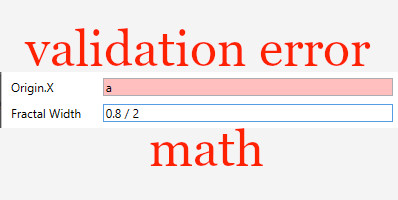

In the bottom left of the "settings area" are color options. See the colors section.

In the bottom right of the "settings area" are three buttons. The "Go" command will calculate data for the provided parameters. Once calculation beings, this will change to say "Cancel". Clicking on the button while calculation is running will cancel the current calculation.

Note: when color information is "saved" or when point information is computed (clicking "Go"), the current settings are saved to disk. When the application starts it will attempt to reload the previous settings from "session.json" file (located in same directory as executable).

The "reset to default" button will change the "settings area" values back to the application default values.

The "reset to previous" button will reset the origin, fractal width, and fractal height to the last used values.

### Colors

In the bottom left of the "settings area" are two buttons, "Manage" (for manage colors), and "Recolor".

The "Recolor" button applies the color specifications to the computed point data. If the color ramp information changes, click the "Recolor" button to apply the new colors without calculating the point data again.

### Color management window

Clicking the "Manage" button will bring up the color management window.

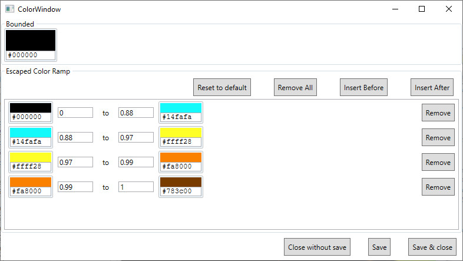

There are several "color controls" shown in the window. Each control has a color display area above, and a textbox input area below. Enter text in the "input" section to change the color.

The text input will accept six digit hex input for RGB values (with or without leading "#"). The input supports a number of "standard" color names, such as "red." The input supports css format "rgb" parameter such as "rgb(255,0,0)".

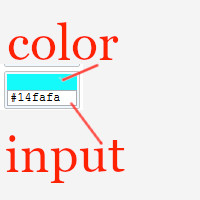

At the top of the window is the "bounded" color section. This is the color used when an evaluated point does not escape.

Below is the "Escaped Color Ramp" section. This is used to color points that have "escaped."

This section is a "list" of keyframes to apply to the color. For a given pixel it's image "value" will fall between 0 and 1, either as a percent of the max iterations (histogram disabled), or as a computed histogram value. For each image "value", a keyframe is chosen to resolve this to a color. The value is then linearly interpolated (in RGB colorspace) between the start and end values.

For example, using the default color ramp, an image value of 0.22 would fall in the first keyframe since the value is between 0 and 0.88. The image value maps to a value 25% of the way between the start and end of the range, therefore the resulting color will be #053e3e (using integer truncation).

An individual keyframe can be deleted by clicking the "Remove" button on the right.

Default color values can be restored by clicking the "Reset to default" button.

The "Remove all" button will delete all keyframes.

The "insert before" button will add a new keyframe before the currently selected item, or at the beginning of the list if none is selected.

The "insert after" button will add a new keyframe after the currently selected item, or at the end of the list if none is selected.

At the bottom of the window are three buttons.

The "Close without save" button ignores any changes since the previous save (or since the window was opened) and closes the color management window.

The "Save" button saves the current color ramp. Saving will apply some simple validation. "Starting" values need to be smaller (or equal to) "ending" values. No gaps are allowed in the covered range. The application will automatically adjust the range values to resolve these issues when saving. Saving does not automatically apply the new colors to the rendered image, the "Recolor" button must be clicked in the "settings area." Note: Saving color information saves all session settings to disk.

The "Save and close" button saves the color information the same as the "save" button but also closes the color management window.

### Status bar

Note that computing the points in the image is composed of a number of tasks, and each task will have to process a number of "items" (the points).

The status bar shows progress for the current calculation. In the bottom left is a description of the current task, or what is currently being worked on in the task. Next is shown the current item being processed and the total number of items (points). Following is a graphical progress bar to process all the items (points) in the current task. Finally the total runtime for the current task is given. 

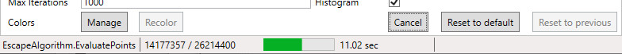

### Menu

The menu only has two options. The first is to save the image. The list of supported file types is given as a filter option in the dialog.

The second option is the same as the first, but will also save the meta data of the run, such as origin, fractal width, etc. The same filename as the image is used, but with a "txt" extension.

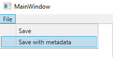
