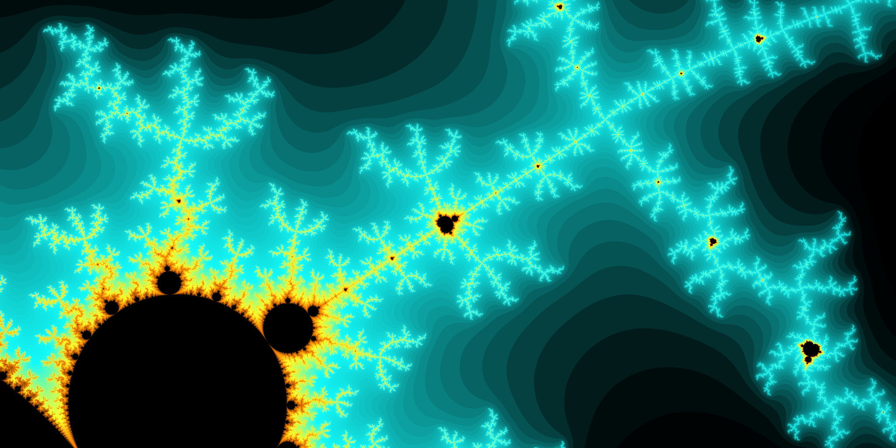

# FracView
C# fractal viewer.

This solution deals with escape algorithm fractals.

World parameters are given to define the scope of the area to plot. This defines the origin, width and height. Scene parameters are given to define the render resolution, and color ramps for rendering results. There is an option to render colors using a histogram or not. The user can define how values are mapped to colors using a simple keyframe system. Output resolution is user defined.

SkiaSharp is used to convert image data to various formats.

This library currently only implements the Mandelbrot algorithm using native C# types.

There are implementations using decimal (more precise), double (faster), and some modifications to the original Mandelbrot algorithm. No arbitrary precision library was found to be sufficiently fast for rendering results.

## Code

This solution is divded into three projects. See each project for additional documentation.

**FracView**

Base library project. Algorithm classes are defined here. This is where "the math" happens.

**FracViewCmd**

Simple command line utility. Set parameters and generate an image.

**FracViewWpf**

Windows graphical application. Use a mouse to navigate a user specified area of the fractal.

Low resolution (compressed) example image

